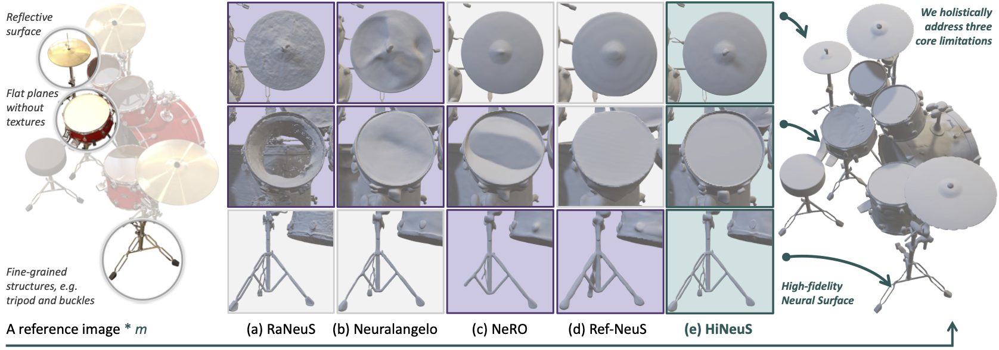
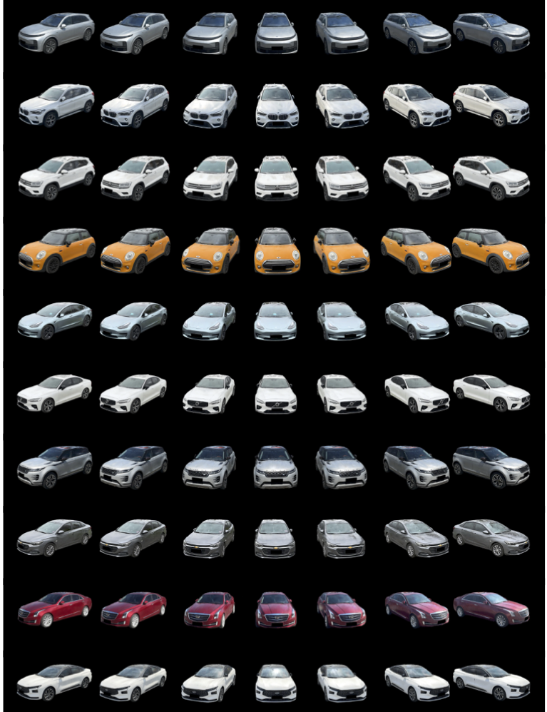

# HiNeuS

<div align="center">


**High-fidelity Neural Surface Relightable Toolkit for 3DRealCar Assets**

Built on **High-fidelity Neural Surface Mitigating Low-texture and Reflective Ambiguity**

[](https://wangyida.github.io/posts/hineus/)
[](https://arxiv.org/abs/2506.23854)
[](https://arxiv.org/abs/2506.23854)

</div>

---

<div align="center">
  
</div>

---

## Quick Start

### Installation

```bash
# Clone the repository
git clone https://github.com/wangyida/hineus.git
cd HiNeuS

# Install dependencies
pip install -r requirements.txt

# Install additional dependencies
nvdiffrast: https://nvlabs.github.io/nvdiffrast/#installation
raytracing: https://github.com/ashawkey/raytracing
```

> **Note:** Ensure you have NVIDIA GPU with CUDA support for optimal performance.

---

### 1. Geometric Learning

#### Training

Train neural surface representations for both synthetic and real-world data:

```bash
# NeRF synthetic data
python run_training.py \
  --cfg configs/shape/nerf/general.yaml \
  object=drums \
  dataset_dir=${your-path}/dataset/nerf_synthetic

# COLMAP real-world data
python run_training.py \
  --cfg configs/shape/real/general.yaml \
  object=sedan \
  dataset_dir=${your-path}/dataset/real \
  name={optional-custom-folder-name}
```

**Outputs:**
- Intermediate visualizations: `data/train_vis/`
- Trained models: `data/model/`

#### Mesh Extraction

Extract high-quality meshes from trained neural representations:

```bash
python extract_mesh.py \
  --cfg configs/shape/real/general.yaml \
  object=sedan \
  dataset_dir=${your-path}/dataset/real \
  name={optional-custom-folder-name}
```

**Outputs:**
- Extracted meshes: `data/meshes/`

### 2. Material Estimation

#### Training

Estimate BRDF materials from reconstructed meshes:

```bash
# Estimate BRDF for sedan from COLMAP project
python run_training.py \
  --cfg configs/material/real/general.yaml \
  object=sedan \
  dataset_dir=${your-path}/dataset/real \
  mesh=${your-mesh-path}.ply
```

**Outputs:**
- Training visualizations: `data/train_vis/`
- Material models: `data/model/`

#### Extract Materials

Extract and save material properties:

```bash
# Synthetic data example
python extract_materials.py --cfg configs/material/syn/bell.yaml

# Real-world data example
python extract_materials.py --cfg configs/material/real/bear.yaml
```

**Outputs:**
- Extracted materials: `data/materials/`

### 3. Relighting

Create stunning relighting effects using HDRI environment maps:

```bash
# Relight with transparency
python relight.py \
  --blender <path-to-your-blender> \
  --name bell-neon \
  --mesh data/meshes/bell_shape-300000.ply \
  --material data/materials/bell_material-100000 \
  --hdr data/hdr/neon_photostudio_4k.exr \
  --trans

# Relight without transparency
python relight.py \
  --blender <path-to-your-blender> \
  --name bear-neon \
  --mesh data/meshes/bear_shape-300000.ply \
  --material data/materials/bear_material-100000 \
  --hdr data/hdr/neon_photostudio_4k.exr
```

**Outputs:**
- Relighting results: `data/relight/{name}/`

---

## Code Architecture

HiNeuS follows a clean, modular architecture designed for extensibility and maintainability:

```
HiNeuS
├── network/         # Neural network architectures
│   ├── shape/          # Shape representation networks
│   └── material/       # Material estimation networks
├── dataset/         # Data loading & preprocessing
├── train/           # Training loops & validation
├── utils/           # Core utilities
│   ├── geometry/       # Geometric operations
│   └── image/          # Image processing
├── colmap/          # COLMAP integration
└── config/          # Configuration files
```

## Acknowledgments

We extend our gratitude to the foundational work of these excellent projects:

<div align="center">
  <a href="https://liuyuan-pal.github.io/NeRO/">
    
  </a>
  <a href="https://github.com/hugoycj/Instant-angelo/">
    
  </a>
  <a href="https://xiaobiaodu.github.io/3drealcar/">
    
  </a>
</div>

Special thanks to the 3DRealCar dataset contributors for providing valuable real-world assets for our research.

---

<div align="center">
  
</div>

---

## Citation

If you find HiNeuS useful in your research, please cite our papers:

```bibtex
@inproceedings{wang2025hineus,
  title={HiNeuS: High-fidelity Neural Surface Mitigating Low-texture and Reflective Ambiguity},
  author={Wang, Yida and Zhang, Xueyang and Zhan, Kun and Jia, Peng and Lang, Xianpeng},
  booktitle={Proceedings of the IEEE/CVF International Conference on Computer Vision},
  year={2025}
}

@inproceedings{du20253drealcar,
  title={3drealcar: An in-the-wild rgb-d car dataset with 360-degree views},
  author={Du, Xiaobiao and Wang, Yida and Sun, Haiyang and Wu, Zhuojie and Sheng, Hongwei and Wang, Shuyun and Ying, Jiaying and Lu, Ming and Zhu, Tianqing and Zhan, Kun and others},
  booktitle={Proceedings of the IEEE/CVF International Conference on Computer Vision},
  pages={26488--26498},
  year={2025}
}
```

---

## Contact & Support

- **Project Website:** [https://wangyida.github.io/posts/hineus/](https://wangyida.github.io/posts/hineus/)
- **Discussions:** [GitHub Discussions](https://github.com/LiAutoAD/HiNeuS/discussions)
- **Issues:** [GitHub Issues](https://github.com/LiAutoAD/HiNeuS/issues)

---

<div align="center">
  <strong>If you find this project helpful, please consider giving it a star!</strong>
</div>
